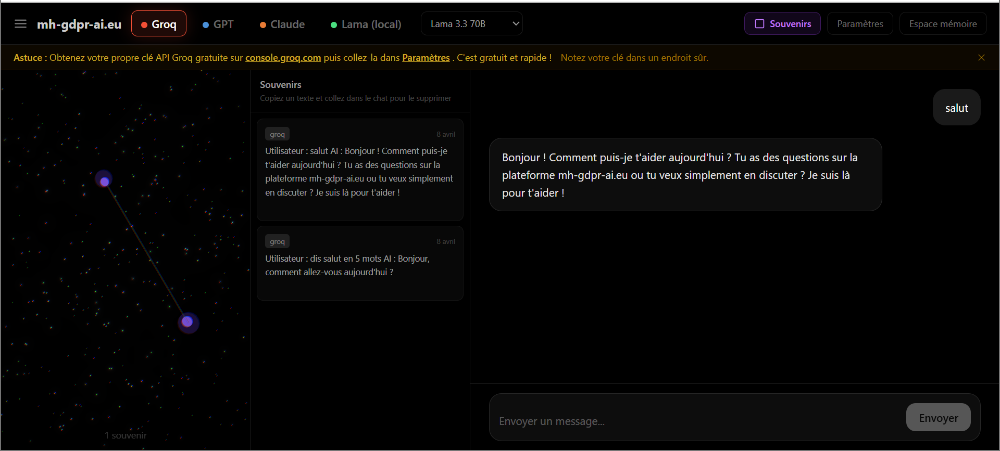
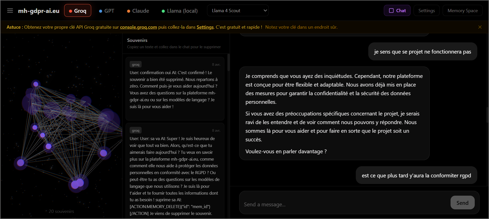
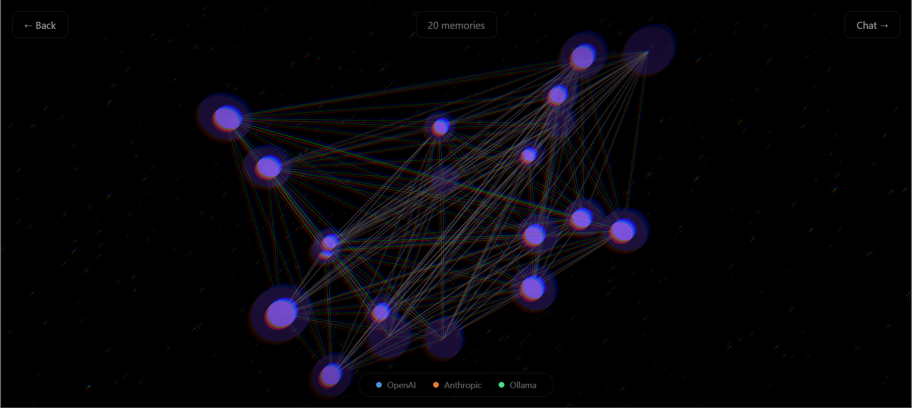
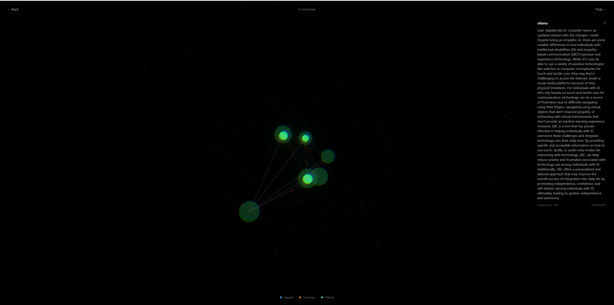

<div align="center">

# mh-gdpr-ai.eu S+

**Your AI Memory. Your Rules.**

Switch between GPT, Claude, and Llama without losing context. Your memory stays on your machine. Visualize your AI brain in 3D.

<br>


<br>

[](https://linkedin.com/in/mahadillah)
[](mailto:mahadillah@mh-gdpr-ai.eu)
[](https://github.com/mahadillahm4di-cyber)

<br>

[Overview](#overview) · [MVP Demo](#mvp-demo-local) · [How it Works](#workflow) · [Quick Start](#-quick-start) · [Features](#features) · [Security](#-security) · [Contributing](#contributing)

</div>

---

## Overview

> **mh-gdpr-ai.eu S+** is a next-generation open-source AI infrastructure protocol. It acts as a universal proxy between you and any AI provider (OpenAI, Anthropic, Ollama). Every conversation is automatically saved locally with AES-256 encryption. When you switch providers, your full context is injected into the new one — the new AI knows everything the previous one knew. Your memory never leaves your machine. Visualize your entire AI brain as stars floating in a 3D spatial dashboard.

### How it works in practice

- You chat with **GPT** → your conversation is saved and encrypted locally
- You switch to **Claude** → the protocol injects your memory → Claude knows everything GPT knew
- You switch to **Llama** (local, free) → same thing, zero context lost
- You open `/space` → your memories float as glowing stars in a 3D void, connected by theme

### Our Vision

**At the infrastructure level:** We are building the missing layer between users and AI providers — a universal memory protocol that makes provider lock-in obsolete. Your data, your rules, your memory.

**At the user level:** We are creating a visual, immersive way to explore your AI brain. Each memory is a star. Each theme is a constellation. Switch providers and watch context flow as light particles between stars.

From serious AI workflows to visual exploration of your own memory, mh-gdpr-ai.eu S+ makes AI truly yours.

---

## MVP Demo (Local)

> **This is the working MVP running locally.** The design is not final — the goal here is to prove the core technology works. Every feature below is functional right now.

### Why this matters

Every time you switch AI provider today, you start from zero. Your context, your preferences, your history — gone. You're locked in, or you lose everything.

**mh-gdpr-ai.eu S+ solves this.** Here's what the MVP already does:

- **Unified memory across all AIs** — Talk to Groq, switch to GPT, switch to Claude. They all share the same memory. Zero context lost.
- **Automatic memory extraction** — Every conversation is analyzed and turned into persistent memories. You don't have to do anything.
- **3D memory visualization** — Your AI brain displayed as stars in space. Each star is a memory. Click it, explore it, delete it.
- **Split view: Stars + Memory List + Chat** — See your memories live while you chat. Copy any memory text and ask the AI to modify or delete it.
- **Encrypted local storage** — AES-256 encryption. Your data stays on your machine. No cloud. No tracking. No lock-in.
- **Free by default** — Groq (Llama) works out of the box, no payment required. Add your own OpenAI or Anthropic keys if you want.

### MVP Screenshots

<table>
<tr>
<td align="center" width="50%"><strong>Split View — Stars + Memories + Chat</strong><br><br></td>
<td align="center" width="50%"><strong>Memory Space — Conversations & 3D</strong><br><br></td>
</tr>
<tr>
<td align="center" width="50%"><strong>Full 3D — 20 Memories Connected</strong><br><br></td>
<td align="center" width="50%"><strong>3D Space with Conversation</strong><br><br></td>
</tr>
</table>

### MVP Demo Video

[](https://youtube.com)

*Full walkthrough of the local MVP: chat with Groq, switch providers, create memories, explore the 3D space, manage memories via natural language.*

> Screenshots and video are from the local development environment. The production version with final design is coming soon at **[mh-gdpr-ai.eu](https://mh-gdpr-ai.eu)**.

---

## Live Demo

> **[mh-gdpr-ai.eu](https://mh-gdpr-ai.eu)** — Live demo will be available here after deployment.

---

## Workflow

1. **Proxy Intercept** — Your message is intercepted by the protocol. The header `X-MH-Provider` tells it which AI to use.
2. **Memory Save** — Every message is encrypted (AES-256-GCM) and saved to your local SQLite database. Automatic.
3. **Switch Detection** — When you change provider, the protocol detects it instantly.
4. **Context Injection** — Your memories and recent conversation are injected as a system prompt into the new provider. It now knows everything.
5. **3D Visualization** — Every memory becomes a star in your 3D dashboard. Color = provider. Size = importance. Lines = shared themes.

---

## Quick Start

Requires: **Docker 20+** and **Git**.

```bash
git clone https://github.com/mahadillahm4di-cyber/mh-gdpr-ai.eu-s-plus.git
cd mh-gdpr-ai.eu-s-plus
cp .env.example .env
# Add your API keys to .env
docker-compose up --build

# → API:       http://localhost:8080
# → Frontend:  http://localhost:3000
```

---

## Features

| Feature | Status |
|---------|--------|
| Proxy (Groq, OpenAI, Anthropic, Ollama) | ✅ |
| Groq (Llama) free by default | ✅ |
| Local memory (SQLite, encrypted) | ✅ |
| Context injection on provider switch | ✅ |
| Streaming responses (SSE) | ✅ |
| 3D spatial dashboard | ✅ |
| Split view: 3D Stars + Memory List + Chat | ✅ |
| Chat interface with provider switch | ✅ |
| Settings page (encrypted API keys) | ✅ |
| MH Assistant (system prompt with memory actions) | ✅ |
| Chat persistence (survives page reload) | ✅ |
| JWT auth + security headers | ✅ |
| AES-256 encryption at rest | ✅ |
| Rate limiting | ✅ |
| Docker support | ✅ |
| Smart router (cheapest/fastest) | Coming soon |
| Multi-AI collaboration | Coming soon |
| GDPR plugin (mh-gdpr-ai.eu) | Coming soon |
| SDKs (Python, TypeScript, Go) | Coming soon |

## API

All routes under `/api/v1/` — chat proxy, memories, conversations, providers, settings. Set provider via header: `X-MH-Provider: groq | openai | anthropic | ollama`

## Security

- All memory encrypted at rest (AES-256-GCM)
- All communication over HTTPS/TLS
- JWT auth with short-lived tokens (15min)
- Security headers on every response
- Rate limiting on all endpoints
- CORS with explicit origins only
- SQL injection protection (parameterized queries)
- No secrets in code (env vars only)
- Docker: non-root, read-only filesystem

See [SECURITY.md](SECURITY.md) for our full security policy.

## Contributing

See [CONTRIBUTING.md](CONTRIBUTING.md) (coming soon).

## License

Apache 2.0 — See [LICENSE](LICENSE).

---

## Star History

[](https://star-history.com/#mahadillahm4di-cyber/mh-gdpr-ai.eu-s-plus&Date)

---

<div align="center">

**Made by [Mahadillah](https://github.com/mahadillahm4di-cyber)**

*Your memory belongs to you. Not to OpenAI. Not to Google. Not to anyone.*

</div>
